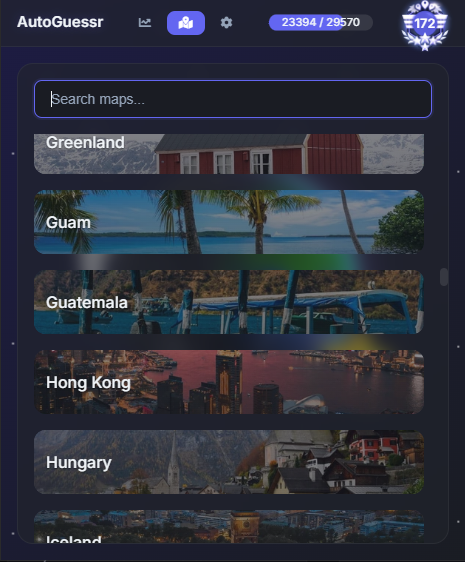
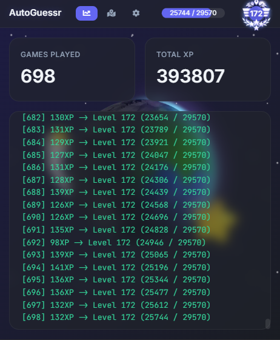
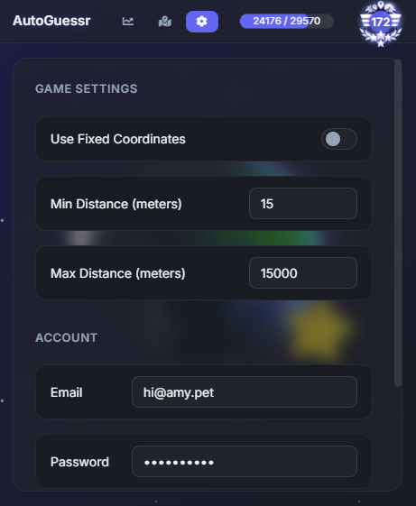

# AutoGuessr

An Electron-based desktop application for automating GeoGuessr gameplay with an intuitive user interface, real-time progress tracking, and customizable settings.

  

    
    
<em>Map Selection</em>

  

  

    
    
<em>Progress Dashboard</em>

  

  

    
    
<em>Settings Panel</em>

  

## Features

### 🗺️ Interactive Map Selection
- Play through official 100+ GeoGuessr maps
- Visual preview for each map
- Quick search functionality
- Country flags for easy identification

### 📊 Live Progress Dashboard
- Games completed counter
- Total XP tracking
- Level progression system
- Real-time game logs
- Color-coded status updates

### ⚙️ Customizable Settings
- Account management
- Distance parameters
  - Minimum distance
  - Maximum distance
- Fixed coordinates toggle (guesses the same coordinates for Guam, Uganda and Sao Tome)
- Session management

## Quick Start

1. Install dependencies: `npm install`
2. Start the app: `npm start`

## Usage

1. Enter your GeoGuessr credentials in Settings
2. Select a map from the Maps tab
3. Switch to Dashboard to monitor progress
4. Watch your XP and levels grow!

## Development

Built with:
- Electron
- Node.js
- HTML/CSS/JavaScript

## Important Notes

- Educational project only
- Use responsibly
- Not affiliated with GeoGuessr
